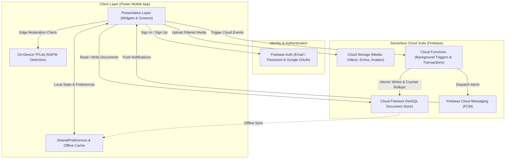

<div align="center">

# 🌟 INTERA

**Ask. Answer. Earn Karma.**

*A next-generation, karma-driven community social network mobile application powered by Flutter, Firebase, and Privacy-Preserving On-Device AI.*

---

[](https://flutter.dev)
[](https://dart.dev)
[](https://firebase.google.com)
[](https://www.tensorflow.org/lite)
[](#)
[](#)

</div>

---

## 📖 Table of Contents
- [Overview](#-overview)
- [Key Features](#-key-features)
- [System Architecture](#-system-architecture)
- [Tech Stack](#-tech-stack)
- [Project Directory Structure](#-project-directory-structure)
- [Edge AI Content Moderation](#-edge-ai-content-moderation)
- [Getting Started](#-getting-started)
  - [Prerequisites](#prerequisites)
  - [Installation & Setup](#installation--setup)
  - [Firebase Configuration](#firebase-configuration)
  - [Running the App](#running-the-app)
- [Database & Security Rules](#-database--security-rules)
- [Future Scalability & Roadmap](#-future-scalability--roadmap)
- [Author & Acknowledgments](#-author--acknowledgments)

---

## 💡 Overview

**INTERA** is a modern social networking platform engineered to replace engagement-bait algorithms with an authentic, incentive-aligned **Karma Reputation Economy**.

Traditional social platforms prioritize doomscrolling and sensationalism. INTERA re-centers the community experience around mutual assistance and high-value knowledge sharing. Users earn **Karma Points** by answering questions, helping fellow members, sharing creative content, and completing peer tasks. 

To safeguard the community without compromising user privacy, INTERA incorporates an **on-device TensorFlow Lite (TFLite) machine learning pipeline** that flags sensitive media locally before it ever reaches cloud storage.

---

## ✨ Key Features

### 💎 1. Karma-Driven Reputation Economy
- **Incentivized Engagement**: Earn Karma points by posting helpful answers, sharing original content, and receiving positive community reactions.
- **Help Requests & Task Bounties**: Users can create task/help requests with reward karma pools, directly compensating peers for verified assistance.
- **Transparent Karma Ledger**: View historical karma gains, distributions, and rank status in real time.
- **Reputation Badges**: Dynamic user tiering based on verified karma thresholds.

### 📱 2. Dual Feeds & Rich Media Creation
- **Dynamic Home Feed**: Chronological and algorithmic feed displaying questions, achievements, discussions, and multi-option polls.
- **Pinterest-Style Discovery Feed**: Staggered masonry layout for visual discovery of community artwork, infographics, and photos.
- **Multi-Reaction Engine**: React with specialized reactions including *Beauty*, *Art*, and *Funny* alongside traditional likes and saves.
- **Interactive Polls**: Community polling with real-time vote distribution metrics and expiration handling.

### 🎥 3. Echos & Sparks (Short-Form Media)
- **Echos**: Immersive full-screen short-form vertical video viewer with custom video controls.
- **Audio Hub & Reuse**: Attach and trace reusable audio tracks across user-generated Echos.
- **Sparks**: Lightweight ephemeral moments and quick status updates.

### 👥 4. Topic-Based Communities
- Dedicated spaces for niches, skills, and academic interests.
- Community creator moderation tools and custom membership feeds.

### 💬 5. Real-Time Chat & Cloud Messaging
- **Direct Messaging**: Instant one-on-one communication with Firestore real-time listeners.
- **Push Notifications**: Cloud-to-device alerts using Firebase Cloud Messaging (FCM) synchronized with `flutter_local_notifications`.

### 🛡️ 6. Edge AI Content Moderation
- **Privacy-Preserving Edge ML**: Pre-upload image classification via TensorFlow Lite directly on the device.
- **Dual-Layer Fallback**: Dynamic skin tone density analysis and sensitive keyword filtering to guarantee a clean ecosystem.

### 🎨 7. Modern Material 3 UI/UX
- Smooth Light & Dark themes with custom color palettes (`AppTheme`).
- Responsive layouts across mobile form factors with micro-animations.

---

## 🏗️ System Architecture



---

## 🛠️ Tech Stack

| Domain | Technology / Library | Purpose |
| :--- | :--- | :--- |
| **Framework** | [Flutter](https://flutter.dev) (Dart 3.x) | Cross-platform mobile development (Android & iOS) |
| **Authentication** | [Firebase Auth](https://firebase.google.com/docs/auth) | Google OAuth & Email/Password authentication |
| **Database** | [Cloud Firestore](https://firebase.google.com/docs/firestore) | Real-time NoSQL document storage |
| **Object Storage** | [Firebase Storage](https://firebase.google.com/docs/storage) | Cloud storage for photos, echos, avatars, and audio |
| **Cloud Functions** | [Firebase Functions](https://firebase.google.com/docs/functions) | Serverless backend execution for background workflows |
| **Push Notifications** | [Firebase Cloud Messaging](https://firebase.google.com/docs/cloud-messaging) + `flutter_local_notifications` | Foreground & background push alerts |
| **On-Device AI/ML** | [tflite_flutter](https://pub.dev/packages/tflite_flutter) | Edge NSFW classification ($224 \times 224$ input tensor) |
| **Video & Media** | `video_player`, `video_thumbnail`, `image_picker` | Video playback, thumbnail generation, camera capture |
| **Local Cache** | `shared_preferences` | User theme settings, cached flags, offline session |

---

## 📂 Project Directory Structure

```text
intera/
├── android/                 # Android native build configurations
├── assets/
│   └── models/              # On-device TFLite models (e.g., nsfw_detector.tflite)
├── functions/               # Firebase Cloud Functions (TypeScript/Node.js)
├── ios/                     # iOS native build configurations
├── lib/
│   ├── core/                # Core architecture & app-wide singletons
│   │   ├── constants/       # App strings, color tokens, and asset paths
│   │   ├── karma/           # KarmaService, ledger, and badge components
│   │   ├── routes/          # Centralized named routes (AppRoutes)
│   │   ├── services/        # Firebase, FCM, Reaction, Follow & Permission services
│   │   ├── theme/           # Light & Dark theme definitions (AppTheme)
│   │   └── utils/           # Image helpers, AI moderation & skin-tone fallback
│   ├── features/            # Feature-driven modular slices
│   │   ├── auth/            # Login, SignUp, Splash, Email Verification & Onboarding
│   │   ├── create/          # Post creation, community creation, help requests
│   │   ├── echos/           # Short-form video player (Echos), audio pages
│   │   ├── home/            # Home feed, Pinterest feed, sparks, post details
│   │   ├── messaging/       # Real-time 1-on-1 chat rooms & conversation lists
│   │   ├── navigation/      # BottomNavScreen navigation scaffold
│   │   ├── notifications/   # In-app notification center
│   │   ├── profile/         # User profile, edit profile, karma rank display
│   │   ├── search/          # Search users, tags, communities, and content
│   │   ├── tasks/           # Help requests, karma bounty board
│   │   └── videos/          # Community video channels & video widgets
│   ├── shared/              # Shared data models & widgets
│   │   ├── models/          # Post, User, Community, Comment, Task models
│   │   └── widgets/         # Custom buttons, cards, avatars, loading indicators
│   ├── firebase_options.dart # Generated Firebase configuration options
│   └── main.dart            # Application entrypoint
├── firestore.rules          # Firestore role-based security rules
├── firestore.indexes.json   # Composite index definitions for Firestore queries
├── system_design.md         # Comprehensive system design document
└── pubspec.yaml             # Dart dependencies and assets declaration
```

---

## 🧠 Edge AI Content Moderation

INTERA prioritizes user privacy and system efficiency by keeping content moderation on the client device:

```
[ User Selects Image ]
          │
          ▼
┌──────────────────────────────────────────────┐
│  Step 1: Pre-process & Resize (224 x 224)    │
└──────────────────────┬───────────────────────┘
                       │
                       ▼
┌──────────────────────────────────────────────┐
│  Step 2: TensorFlow Lite Inference           │
│  (nsfw_detector.tflite)                      │
└──────────────────────┬───────────────────────┘
                       │
        ┌──────────────┴──────────────┐
   [ Model Success ]            [ Exception / Fallback ]
        │                             │
        ▼                             ▼
Threshold > 0.70?             Skin-Tone Density Test
  ├─ YES ──> Block Upload       ├─ > 38% ──> Block Upload
  └─ NO  ──> Allow Upload       └─ <= 38% ─> Allow Upload
```

1. **Local Tensor Processing**: Selected images are scaled down to $224 \times 224 \times 3$ normalized RGB float tensors.
2. **On-Device Inference**: `tflite_flutter` runs inference in milliseconds with zero server latency and zero cloud scanning costs.
3. **Adaptive Fallback Engine**: If the neural network interpreter is uninitialized, the app runs an automated skin pixel chrominance density analysis (YCbCr / RGB color boundaries) plus sensitive keyword checks.

---

## 🚀 Getting Started

### Prerequisites

Ensure the following tools are installed on your workstation:
- **Flutter SDK**: `^3.0.0` or higher ([Install Guide](https://docs.flutter.dev/get-started/install))
- **Dart SDK**: `^3.0.0`
- **Android Studio** / **Xcode** (for iOS simulator/builds)
- **Firebase CLI**: `npm install -g firebase-tools`

### Installation & Setup

1. **Clone the repository**:
   ```bash
   git clone https://github.com/your-username/intera.git
   cd intera/intera
   ```

2. **Install Flutter dependencies**:
   ```bash
   flutter pub get
   ```

3. **Verify Flutter environment**:
   ```bash
   flutter doctor
   ```

### Firebase Configuration

1. Initialize or select your Firebase project:
   ```bash
   firebase login
   flutterfire configure
   ```
2. Verify that `lib/firebase_options.dart` is populated with your project's API keys.
3. Deploy Firestore rules and indexes:
   ```bash
   firebase deploy --only firestore:rules,firestore:indexes
   ```

### Running the App

Run on an active emulator or connected physical device:
```bash
# Debug Mode
flutter run

# Release Mode (Android)
flutter run --release
```

---

## 🔒 Database & Security Rules

All Firestore access is secured via declarative, role-based rules defined in [`firestore.rules`](./firestore.rules):
- **Authenticated Access**: Unauthenticated read/write requests are rejected.
- **Resource Ownership**: Only post and comment authors can mutate or delete their original text content.
- **Field-Level Guards**: Community members can only increment reaction arrays without overwriting author payloads.
- **Karma Integrity**: Bounties and balance transfers are validated to prevent client-side point manipulation.

---

## 📈 Future Scalability & Roadmap

As documented in [`system_design.md`](./system_design.md), the system is architected to scale to **10M+ Monthly Active Users (MAUs)** with the following planned milestones:
- [ ] **Distributed Counter Shards**: Transition post like/reaction counts into distributed sub-document shards to eliminate single-document Firestore write contention ($>1\text{ write/sec}$).
- [ ] **Server-Side Feed Curation**: Offload the client-side recommendation engine (`feed_algorithm.dart`) to a serverless pipeline utilizing cursor-based Firestore pagination and Vector Search.
- [ ] **Live Audio Spaces**: Interactive audio rooms for community discussions and Q&A.
- [ ] **Direct Creator Payouts**: Convert top Karma achievements into real-world rewards and creator grants.

---

## 👨‍💻 Author & Acknowledgments

- **Krish Sharma** — *Lead Developer & Architect*
  - Department of Computer Science & Engineering
  - Project developed as part of B.Tech CSE Summer Training & Engineering Portfolio.

---

<div align="center">
  <sub>Built with ❤️ using Flutter & Firebase. © 2026 INTERA. All Rights Reserved.</sub>
</div>
