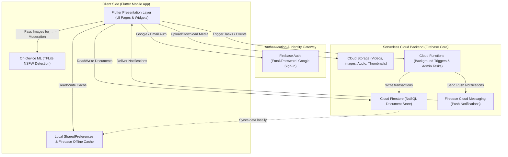
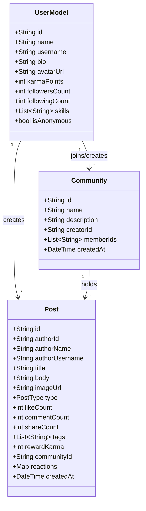

# INTERA System Design & Architecture Analysis

## 1. High-Level Technology Stack & Architecture

INTERA is a karma-driven community social network. The platform architecture leverages a serverless cloud backend combined with an on-device machine learning model for content safety.

### Technology Stack
*   **Frontend**: Flutter (Dart) targeting Android, iOS, and Web.
*   **Database**: Google Cloud Firestore (NoSQL document-store).
*   **Authentication**: Firebase Authentication (Email/Password, Google OAuth).
*   **Cloud Storage**: Firebase Storage (for media, avatars, videos, thumbnails, and audio).
*   **Cloud Functions**: Firebase Cloud Functions for transactional backend tasks.
*   **Push Notifications**: Firebase Cloud Messaging (FCM) + `flutter_local_notifications` package.
*   **On-Device AI/ML**: TensorFlow Lite (`tflite_flutter`) for edge NSFW content detection.

---

## 2. System Architecture Diagram

This diagram visualizes how the Flutter app, local cache, authentication gateway, and serverless backend services communicate:

---

## 3. Data Model & Database Architecture

INTERA uses Cloud Firestore in a schema-less structure with relational links mapped in Dart models.

---

## 4. How Many Users Can Use This App? (Scalability Analysis)

Since the app leverages **Firebase's Serverless Suite**, the application's scalability and max capacity are determined by Firebase’s resource allocations and limitations.

### A. Core Capacity Limits (Firebase Scale)

| Service | Firebase Default Quota | User Base Capability |
| :--- | :--- | :--- |
| **Authentication** | 100M+ total users | Unlimited scale for active sign-ins |
| **Firestore Connections** | 1,000,000 concurrent connections | **10,000,000 to 20,000,000 Monthly Active Users (MAUs)** |
| **Firestore Writes** | 10,000 writes per second | Can support hundreds of transactions per second easily |
| **Firestore Reads** | Scalable up to billions of reads | Scaled automatically |
| **Cloud Storage Bandwidth** | Auto-scaling (starts at GBs/second) | Easily stores exabytes of images/videos/audio |
| **Push Notifications (FCM)** | Billions of messages per day | Supports millions of active users chatting in real-time |

### B. Identified Scaling Bottlenecks & Design Improvements

While the platform backend is serverless and scales automatically, there are two primary architectural bottlenecks in the current codebase that must be solved before scaling to millions of users:

#### 1. Client-Side Feed Ranking (In `feed_algorithm.dart`)
*   **The Issue**: The current feed recommendation system loads all posts and user signals (`likedPostIds`, `savedPostIds`, following lists), then ranks them client-side in the Flutter app. If there are 100,000 posts in the database, loading and ranking them in memory will crash the client app due to high memory usage and bandwidth drainage.
*   **The Solution**: Transition to **Server-Side Feed Generation**.
    *   Implement cursor-based pagination (using Firestore `limit()` and `startAfter()`).
    *   Use a search/recommendation indexer (e.g., Algolia, Meilisearch, or pgvector/Vertex AI search) to index and retrieve posts relevant to user tags.

#### 2. Single Document Hot-Spot Write Limit
*   **The Issue**: Firestore has a strict limit of **1 write per second per document**. In a viral community, if thousands of users try to like/react to the same popular post simultaneously, writes will conflict and fail (transaction contention).
*   **The Solution**: Implement **Distributed Counters**. Instead of updating the `likeCount` directly on the main Post document, store likes across 10-20 "counter shards" (sub-documents) and sum them up on the client, or use Cloud Functions to buffer and aggregate increments.

---

## 5. Security and Moderation

### A. Access Rules
Firestore rules (`firestore.rules`) enforce strict role-based access:
*   Only authenticated users can read posts, communities, and profiles.
*   Only document owners (e.g., the author of a post) can update or delete their content.
*   Users can only modify interaction fields (like incrementing `likeCount` or updating `reactions`) on others' posts.

### B. Edge-Based AI Moderation (NSFW Filtering)
Rather than wasting server resources and introducing latency, INTERA executes a pre-trained **TensorFlow Lite (TFLite) classifier** (`nsfw_detector.tflite`) directly on-device before media is uploaded to Cloud Storage:
1.  **Local Inference**: It resizes images to $224 \times 224$ and passes them to the TFLite model.
2.  **Skin Tone Fallback**: If TFLite is unavailable or fails, it falls back to a skin-tone density analysis algorithm that flags media if skin pixels exceed $38\%$.
3.  **Keyword Filtering**: Checks post texts against common sensitive keywords before publishing.
